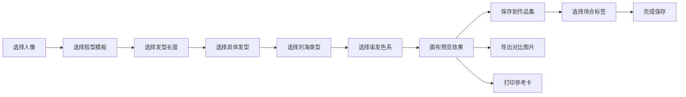

## 1. 产品概述

个人发型搭配脸型模拟与尝试记录器是一款纯前端工具，帮助用户在换发型前直观预览不同发型、发色与脸型的搭配效果，并记录尝试历史以便参考决策。

- 核心功能：脸型识别、发型虚拟试戴、发色预览、作品集管理
- 目标用户：想要更换发型但不确定效果的人群
- 产品价值：降低发型试错成本，提供便捷的虚拟体验和决策参考

## 2. 核心功能

### 2.1 用户角色
| 角色 | 注册方式 | 核心权限 |
|------|----------|----------|
| 普通用户 | 无需注册，本地使用 | 上传人像、选择脸型、试戴发型、保存作品集、导出图片 |

### 2.2 功能模块
1. **脸型画布区**：人像上传/选择、脸型模板选择、发型叠加预览
2. **发型库面板**：短发/中长发/长发分类展示、刘海类型选择
3. **色卡面板**：染发色系选择（冷棕/亚麻/玫红/蓝黑）
4. **试戴历史/作品集**：按场合标签分类、保存搭配方案
5. **导出功能**：导出对比图片、打印参考卡

### 2.3 页面详情
| 页面名称 | 模块名称 | 功能描述 |
|---------|---------|---------|
| 主页面 | 脸型画布区 | 上传/选择人像、选择脸型模板、实时预览发型叠加效果 |
| 主页面 | 发型库面板 | 按长度分类展示发型，选择刘海类型，点击应用到画布 |
| 主页面 | 色卡面板 | 展示染发色系色卡，点击切换发色效果 |
| 主页面 | 作品集面板 | 展示历史试戴记录，按场合标签筛选，支持删除和查看详情 |
| 主页面 | 工具栏 | 保存搭配、导出图片、打印参考卡按钮 |

## 3. 核心流程

用户选择或上传人像 → 选择脸型模板 → 浏览发型库选择发型 → 选择刘海类型 → 选择染发颜色 → 在画布上预览效果 → 保存到作品集（可选场合标签）→ 可导出对比图或打印参考卡

## 4. 用户界面设计

### 4.1 设计风格
- **设计方向**：优雅美妆风格，柔和渐变，精致卡片式布局
- **主色调**：玫瑰粉渐变（#FF6B9D → #C44569），辅以裸米色背景
- **辅助色**：冷棕、亚麻金、玫红、蓝黑（发色展示色）
- **按钮风格**：圆角胶囊按钮，柔和阴影，悬停微放大效果
- **字体**：标题使用优雅衬线字体，正文使用简洁无衬线字体
- **布局风格**：三栏式布局（左侧发型库 + 中间画布区 + 右侧作品集）
- **视觉元素**：柔和阴影、毛玻璃效果、渐变色块、精致图标

### 4.2 页面设计概述
| 页面名称 | 模块名称 | UI元素 |
|---------|---------|--------|
| 主页面 | 脸型画布区 | 圆形/椭圆画布容器、人像上传按钮、脸型选择标签、发型叠加层 |
| 主页面 | 发型库面板 | 分类标签页（短/中/长）、发型卡片网格、刘海选择器 |
| 主页面 | 色卡面板 | 圆形色卡、色卡名称、选中态高亮 |
| 主页面 | 作品集面板 | 场合标签筛选、历史记录卡片列表、删除按钮 |
| 主页面 | 底部工具栏 | 保存按钮、导出按钮、打印按钮 |

### 4.3 响应式
- 桌面端优先设计（1280px+）
- 平板端：两栏布局，画布区放大
- 移动端：单栏纵向布局，所有面板折叠为可展开区域
- 触控优化：增大点击区域，支持滑动切换发型

### 4.4 动画与交互
- 页面加载时元素渐入动画
- 发型选择时画布平滑过渡
- 色卡切换时发色渐变效果
- 保存成功时的弹跳提示
- 卡片悬停时轻微上浮+阴影加深
