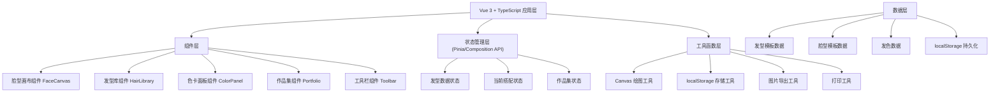

## 1. 架构设计



## 2. 技术描述

- **前端框架**：Vue 3 + TypeScript + Vite
- **构建工具**：Vite 5.x
- **样式方案**：SCSS + CSS Variables
- **状态管理**：Vue Composition API + reactive
- **画布渲染**：HTML5 Canvas API
- **数据存储**：localStorage（纯前端）
- **图标**：SVG 内联图标
- **端口**：9151

## 3. 目录结构

```
src/
├── components/
│   ├── FaceCanvas.vue        # 脸型画布主组件
│   ├── HairLibrary.vue       # 发型库面板
│   ├── ColorPanel.vue        # 色卡面板
│   ├── Portfolio.vue         # 作品集/历史记录
│   └── Toolbar.vue           # 底部工具栏
├── composables/
│   ├── useHairStyle.ts       # 发型相关逻辑
│   ├── usePortfolio.ts       # 作品集管理
│   └── useCanvas.ts          # Canvas 绘图逻辑
├── data/
│   ├── hairstyles.ts         # 发型模板数据
│   ├── faceShapes.ts         # 脸型模板数据
│   └── hairColors.ts         # 发色数据
├── types/
│   └── index.ts              # TypeScript 类型定义
├── utils/
│   ├── storage.ts            # localStorage 工具
│   ├── export.ts             # 图片导出工具
│   └── print.ts              # 打印工具
├── App.vue
└── main.ts
```

## 4. 类型定义

### 4.1 核心类型

```typescript
// 脸型类型
type FaceShapeType = 'oval' | 'round' | 'square' | 'long' | 'diamond'

// 发型长度
type HairLength = 'short' | 'medium' | 'long'

// 刘海类型
type BangsType = 'none' | 'straight' | 'side' | 'middle'

// 场合标签
type OccasionTag = 'work' | 'date' | 'vacation'

// 发型
interface Hairstyle {
  id: string
  name: string
  length: HairLength
  bangs: BangsType
  suitableFaces: FaceShapeType[]
  svgPath: string
  description: string
}

// 发色
interface HairColor {
  id: string
  name: string
  color: string
  colorGradient: string
}

// 脸型
interface FaceShape {
  type: FaceShapeType
  name: string
  description: string
  svgPath: string
}

// 搭配方案
interface Outfit {
  id: string
  name: string
  hairstyleId: string
  hairColorId: string
  faceShapeType: FaceShapeType
  bangsType: BangsType
  occasionTags: OccasionTag[]
  portraitImage?: string  // base64
  createdAt: number
}

// 作品集
interface Portfolio {
  outfits: Outfit[]
}
```

## 5. 数据模型

### 5.1 本地存储结构

- Key: `hair-portfolio`
- Value: 序列化的 Outfit[] 数组
- 存储限制：单条记录图片 base64 不超过 500KB

### 5.2 初始数据

- 5 种脸型模板（SVG 绘制）
- 12 种发型（短/中/长各 4 种）
- 4 种染发色系
- 3 种场合标签

## 6. 关键技术实现

### 6.1 Canvas 发型叠加
- 使用 Canvas 2D API 绘制人像底图
- 发型使用 SVG 路径转换后叠加渲染
- 发色通过 globalCompositeOperation 实现颜色混合
- 支持缩放、位置微调

### 6.2 图片导出
- 使用 canvas.toDataURL() 生成 PNG
- 支持导出对比图（原图 vs 效果图）
- 图片质量可配置

### 6.3 打印功能
- 创建打印专用样式
- 生成参考卡布局（人像 + 发型信息 + 场合标签）
- 使用 window.print() 触发打印

### 6.4 响应式布局
- 三栏式桌面布局
- 使用 CSS Grid 和 Flexbox 实现
- 1024px 断点切换为两栏
- 768px 断点切换为单栏
